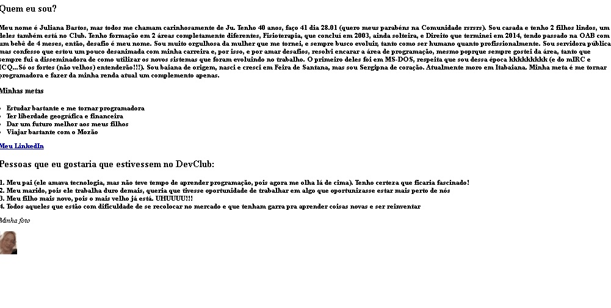

# DevClub_Presentation-HTML

Exercício realizado em HTML para criar um LP de apresentação.
## 🔧 Funçoes (opcional)

### Função 01:
- Treinar HTML

## Veja o desenvolvimento do projeto:

Para ver o desenvolvimento acesse o planejamento:

## Feito Com:

#
### Support Ou Contato

Copyright © 2021 Julilanapbdias

 